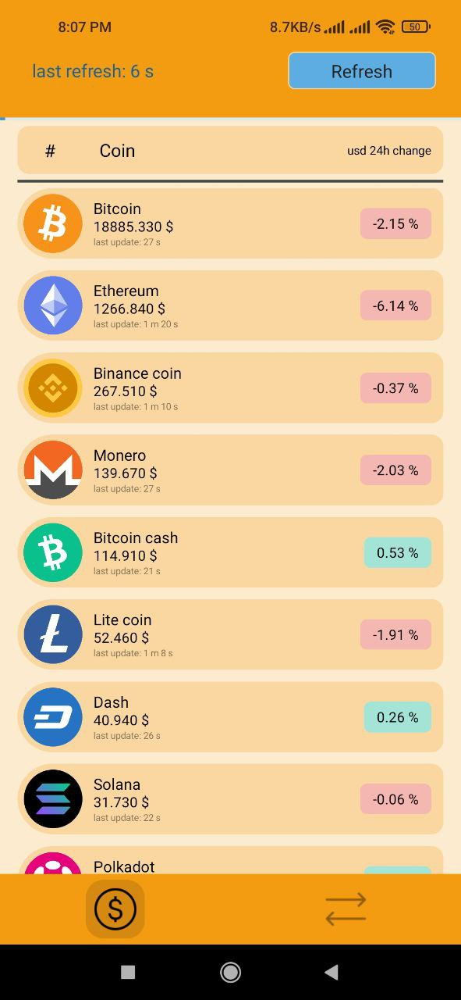
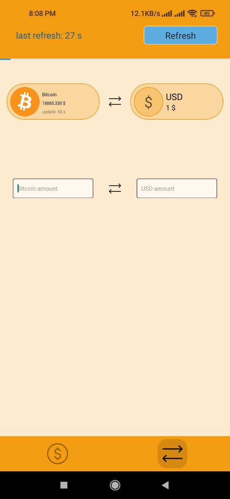
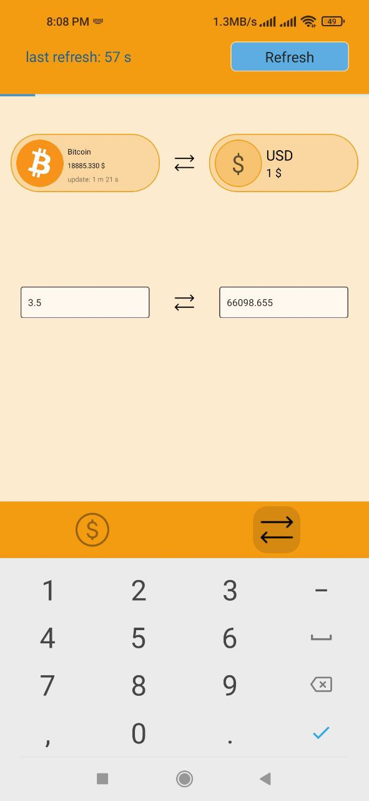
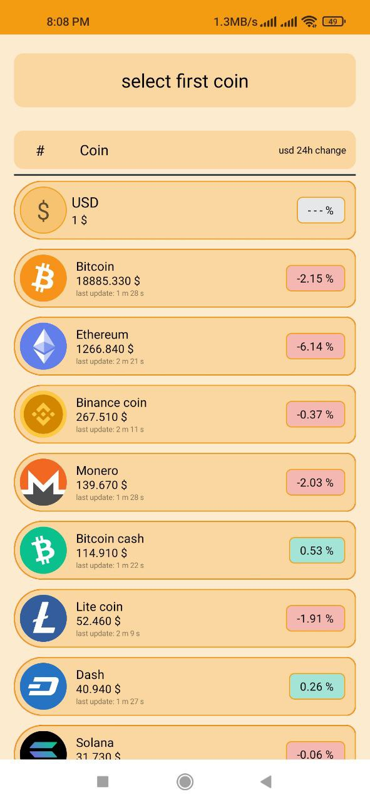
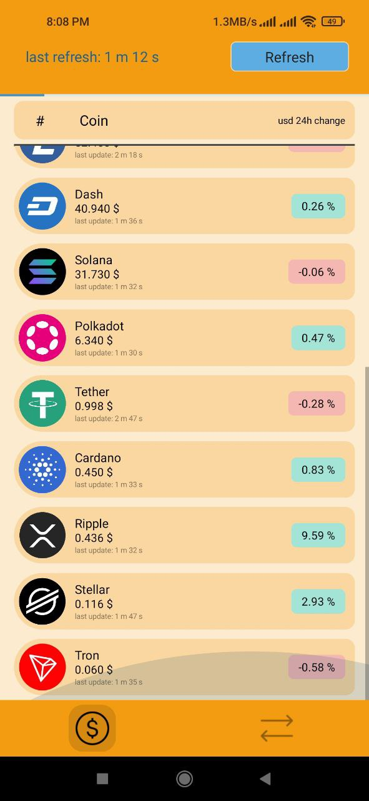

## 🪙 CoinTime — Simple & Clean Crypto Price Tracker

A React Native application designed to provide real-time cryptocurrency prices with a clean and user-friendly interface.  
This repository showcases the UI and user experience of the app.

> **Note:** The source code is private — this repository only includes visual previews.

 

---

## 📱 Screenshots

  
  
  
  
  

---

## ⭐ Features

- Live cryptocurrency price display  
- Clean, minimal UI for quick information access  
- Smooth performance and navigation  
- Mobile-friendly layout  
- Built with React Native using modern component patterns  

---

## 🛠 Tech Stack

- React Native  
- JavaScript

---

## 🎯 Purpose

The goal of CoinTime is to provide a fast and intuitive interface for checking cryptocurrency prices.  
This repository serves as a portfolio showcase of the app’s UI and design.

---

## 📄 About This Repository

This repository contains:

- Project description  
- UI/UX screenshots  
- **No source code** (private)

If you need access for review or collaboration, feel free to open an issue or contact me.

---

